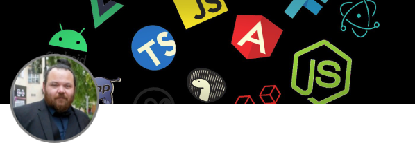

### Salut tout l'monde 👋

<!--
**nicolachoquet06250/nicolachoquet06250** is a ✨ _special_ ✨ repository because its `README.md` (this file) appears on your GitHub profile.

Here are some ideas to get you started:

- 🔭 I’m currently working on ...
- 🌱 I’m currently learning ...
- 👯 I’m looking to collaborate on ...
- 🤔 I’m looking for help with ...
- 💬 Ask me about ...
- 📫 How to reach me: ...
- 😄 Pronouns: ...
- ⚡ Fun fact: ...
-->

# Nicolas Choquet

Développeur Full Stack touche à tout 🙂

Mon langage de prédilection c'est le JavaScript (TypeScript depuis peu) pour son angle d'attaque extra-large.
En gros on peux absoluement tout faire avec en partant évidement du web classique en passant par du mobile et jusqu'à de la réalité virtuelle/augmentée voir du jeu vidéo 😁

## 🚀 À propos de moi

J'ai 29 ans et je suis absoluement passionné de prog.

Ma deuxième passion n'a rien à voir avec l'informatique, c'est le chant 😁

## 🔗 Mes réseaux

## Mes projets phares

### WebOS Apple (Portfolio)

#### Liens

 

#### Technologies utilisées

### Framework de création d'aliases complexes

#### Liens

#### Technologies utilisées

![Powershell](https://img.shields.io/badge/Powershell-000?style=flat&logo=data:image/svg+xml;base64,PHN2ZyB2ZXJzaW9uPSIxLjEiIGlkPSJQb3dlclNoZWxsIiB4bWxucz0iaHR0cDovL3d3dy53My5vcmcvMjAwMC9zdmciIHhtbG5zOnhsaW5rPSJodHRwOi8vd3d3LnczLm9yZy8xOTk5L3hsaW5rIiB4PSIwcHgiIHk9IjBweCIKCSB3aWR0aD0iMjA0LjY5MXB4IiBoZWlnaHQ9IjE1NC41MjFweCIgdmlld0JveD0iMCAwIDIwNC42OTEgMTU0LjUyMSIgc3R5bGU9ImVuYWJsZS1iYWNrZ3JvdW5kOm5ldyAwIDAgMjA0LjY5MSAxNTQuNTIxOyIKCSB4bWw6c3BhY2U9InByZXNlcnZlIj4KPGc+Cgk8cGF0aCBzdHlsZT0iZGlzcGxheTpub25lO2ZpbGwtcnVsZTpldmVub2RkO2NsaXAtcnVsZTpldmVub2RkO2ZpbGw6IzI2NzFCRTsiIGQ9Ik0tNDcuNTQ3LDIyNi44NzIKCQljMC05Ny4xMjksMC4wOTQtMTk0LjI1OS0wLjE5NS0yOTEuMzg3Yy0wLjAyMS02Ljk4MiwxLjQwNC04LjQxMSw4LjM4OC04LjM4OWM5NC4zOTcsMC4yOTIsMTg4Ljc5OCwwLjI5MiwyODMuMTk1LDAKCQljNi45ODQtMC4wMjIsOC40MSwxLjQwNyw4LjM4OSw4LjM4OWMtMC4yODksOTcuMTI4LTAuMTk1LDE5NC4yNTgtMC4xOTUsMjkxLjM4N2MtMy4yMzgsMi4wMDgtNi44MzcsMS4xMjktMTAuMjY4LDEuMTMxCgkJYy05My4wMTUsMC4wNDktMTg2LjAzMSwwLjA0OS0yNzkuMDQ3LDBDLTQwLjcxMSwyMjguMDAxLTQ0LjMxLDIyOC44OC00Ny41NDcsMjI2Ljg3MnoiLz4KCTxwYXRoIHN0eWxlPSJmaWxsLXJ1bGU6ZXZlbm9kZDtjbGlwLXJ1bGU6ZXZlbm9kZDtmaWxsOiNFMEVBRjU7IiBkPSJNMTIwLjE0LDAuMDMyYzIzLjAxMS0wLjAwOCw0Ni4wMjMtMC4wNzgsNjkuMDM0LDAuMDE5CgkJYzEzLjY4LDAuMDU2LDE3LjUzNyw0LjYyNywxNC41ODgsMTguMTM3Yy04LjYzNiwzOS41NjYtMTcuNDY2LDc5LjA5Mi0yNi40MTUsMTE4LjU4OWMtMi44MywxMi40ODQtOS4zMzIsMTcuNTk4LTIyLjQ2NSwxNy42MzcKCQljLTQ2LjAyMywwLjEzNy05Mi4wNDYsMC4xNTItMTM4LjA2OC0wLjAwNmMtMTUuMDQzLTAuMDUzLTE5LTUuMTQ4LTE1Ljc1OS0xOS40MDRDOS44NDksOTYuMjg3LDE4LjY5LDU3LjU4MiwyNy42MDIsMTguODkyCgkJQzMwLjk5Nyw0LjE0OCwzNi4wOTksMC4xLDUxLjEwNCwwLjA1N0M3NC4xMTYtMC4wMDgsOTcuMTI4LDAuMDQsMTIwLjE0LDAuMDMyeiIvPgoJPHBhdGggc3R5bGU9ImZpbGwtcnVsZTpldmVub2RkO2NsaXAtcnVsZTpldmVub2RkO2ZpbGw6IzI2NzFCRTsiIGQ9Ik04NS4zNjUsMTQ5LjgxM2MtMjMuMDE0LTAuMDA4LTQ2LjAyOSwwLjA5OC02OS4wNDItMC4wNTMKCQljLTExLjY3LTAuMDc2LTEzLjc5Mi0yLjgzLTExLjE2NS0xNC4yNDRjOC45MDYtMzguNzEsMTguMDk5LTc3LjM1NSwyNi44MDctMTE2LjEwOUMzNC4zLDkuMDEzLDM5LjMzNyw0LjQxOSw1MC40NzMsNC41MjIKCQljNDYuMDI0LDAuNDI3LDkyLjA1NiwwLjEzNywxMzguMDgzLDAuMTg0YzExLjU0MywwLjAxMSwxMy40ODEsMi40OCwxMC44OSwxNC4xODdjLTguNDEzLDM4LjAwNy0xNi44NzksNzYuMDAzLTI1LjQ5NCwxMTMuOTY1CgkJYy0zLjIyNCwxNC4yMDctNi45MzgsMTYuOTE4LTIxLjg4NSwxNi45NTFDMTI5LjgzMywxNDkuODU2LDEwNy41OTgsMTQ5LjgyMSw4NS4zNjUsMTQ5LjgxM3oiLz4KCTxwYXRoIHN0eWxlPSJmaWxsLXJ1bGU6ZXZlbm9kZDtjbGlwLXJ1bGU6ZXZlbm9kZDtmaWxsOiNGREZERkU7IiBkPSJNMTA0Ljk0OCw3My45NTFjLTEuNTQzLTEuODEtMy4yMzctMy44OTQtNS4wMzEtNS44ODYKCQljLTEwLjE3My0xMS4zLTIwLjI1Ni0yMi42ODQtMzAuNjEtMzMuODE1Yy00LjczOC01LjA5NC02LjI0OC0xMC4wNDEtMC41NTgtMTUuMDY5YzUuNjIzLTQuOTcsMTEuMTQ4LTQuNTMsMTYuMzA2LDEuMTg4CgkJYzE0LjM2NSwxNS45MTksMjguNzEzLDMxLjg1Niw0My4zMTYsNDcuNTU2YzUuNDUyLDUuODY0LDQuMTgyLDkuODUxLTEuODIzLDE0LjE5NmMtMjMuMDQ5LDE2LjY4My00NS45NjgsMzMuNTQ3LTY4Ljg2Miw1MC40NDMKCQljLTUuMTQ2LDMuNzk5LTEwLjA1Miw0Ljc1LTE0LjIwOS0wLjg2MWMtNC41ODYtNi4xODktMC4zNDMtOS44NzEsNC40MTQtMTMuMzM1YzE3LjAxMy0xMi4zOTIsMzMuOTkzLTI0LjgzLDUwLjktMzcuMzY2CgkJQzEwMS4xNDYsNzkuMjU2LDEwNC41MjcsNzguMjM4LDEwNC45NDgsNzMuOTUxeiIvPgoJPHBhdGggc3R5bGU9ImZpbGwtcnVsZTpldmVub2RkO2NsaXAtcnVsZTpldmVub2RkO2ZpbGw6I0ZDRkRGRDsiIGQ9Ik0xMTIuMjM1LDEzMy44MTljLTYuMTk2LDAtMTIuNDAxLDAuMjEzLTE4LjU4My0wLjA2OAoJCWMtNC45MzItMC4yMjMtNy45LTIuOTc5LTcuODM4LTguMTc0YzAuMDYtNC45MTIsMi41MzYtOC42MDUsNy40NjMtOC43MzhjMTMuNTQyLTAuMzYzLDI3LjEwNC0wLjI4NSw0MC42NTEtMC4wMgoJCWM0LjMwNSwwLjA4NCw3LjQ4MywyLjg4OSw3LjQ1Nyw3LjM3NWMtMC4wMzEsNS4xNDYtMi43MzksOS4xMzMtOC4yNSw5LjQ2NWMtNi45NDQsMC40Mi0xMy45MzEsMC4xMDQtMjAuODk5LDAuMTA0CgkJQzExMi4yMzUsMTMzLjc4LDExMi4yMzUsMTMzLjgsMTEyLjIzNSwxMzMuODE5eiIvPgo8L2c+Cjwvc3ZnPg==&logoColor=pin)

### La Devengers Toolbox

#### Liens

 

#### Technologies utilisées

### Editeur visuel en React pour React

#### Liens

 

#### Technologies utilisées

### Editeur visuel en Vue pour Vue

#### Liens

 

#### Technologies utilisées

## Indice sur mes prochains projets 😉

<table style="border-collapse: unset;">
    <tr>
        <td style="border: none;">
            
        </td>
        <td style="border: none;" rowspan="2">
            
        </td>
    </tr>
    <tr>
        <td style="border: none;">
            <a href="./AVATAR-THE-LAST-AIRBENDER.md">
                <picture>
                    <source media="(prefers-color-scheme: dark)" srcset="./assets/logo-avatar-last-airbender-white.png">
                    <source media="(prefers-color-scheme: light)" srcset="./assets/logo-avatar-last-airbender-black.png">
                    
                </picture>
            </a>
        </td>
    </tr>
</table>

Pour ce projet, je cherche **un modelisateur 3D** qui maitrise  mais surtout j'ai besoin que cette personne ait du temps libre à donner car étant donné que la licence appartient en grosse partie à , je ne peux pas me permettre une commercialisation.

Ce projet ne sera donc accessible uniquement aux contributeurs.

  si vous êtes intéressé à rejoindre le projet 😉.

    <a href="mailto:one-piece-vr@nicolaschoquet.fr">
        one-piece-vr@nicolaschoquet.fr
    </a>

<!--

    
Cliquez ici pour télécharger mon CV ...

- [Au format PDF](./assets/cv_assets/CV%20Nicolas%20Choquet%202024.pdf)
- [Au format DOCX](./assets/cv_assets/CV%20Nicolas%20Choquet%202024.docx)

-->
