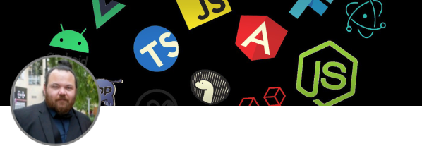
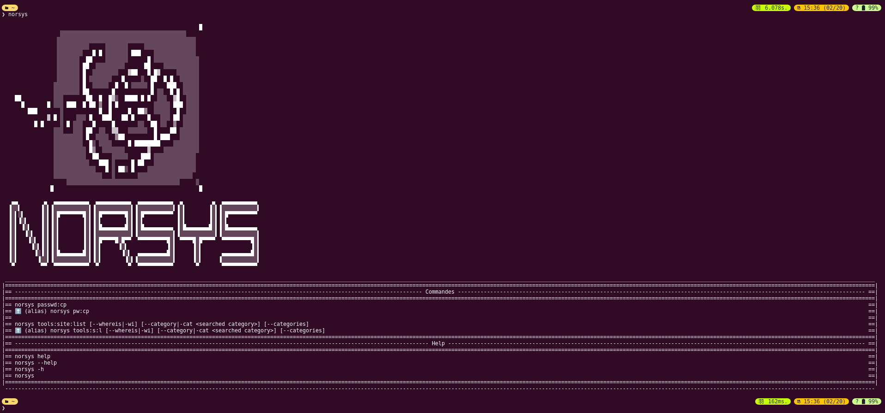
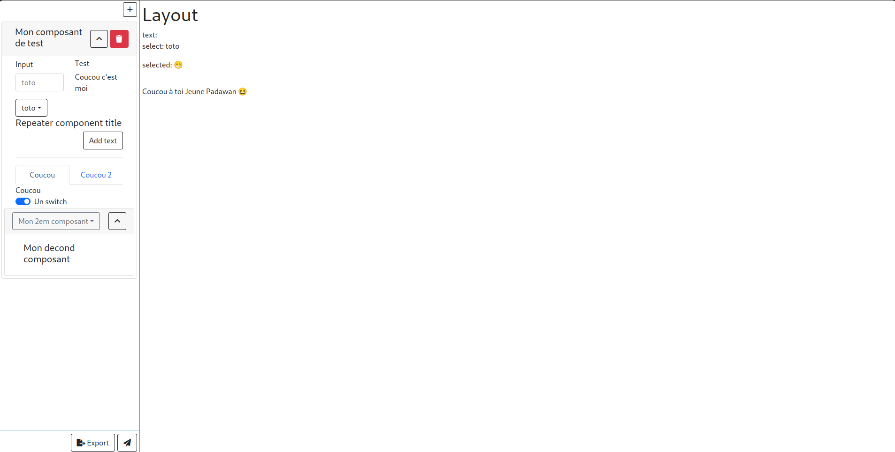
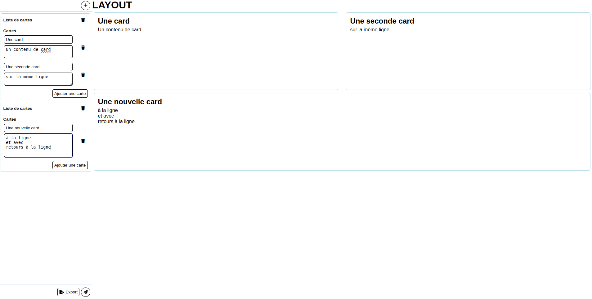

### Salut tout l'monde 👋

<!--
**nicolachoquet06250/nicolachoquet06250** is a ✨ _special_ ✨ repository because its `README.md` (this file) appears on your GitHub profile.

Here are some ideas to get you started:

- 🔭 I’m currently working on ...
- 🌱 I’m currently learning ...
- 👯 I’m looking to collaborate on ...
- 🤔 I’m looking for help with ...
- 💬 Ask me about ...
- 📫 How to reach me: ...
- 😄 Pronouns: ...
- ⚡ Fun fact: ...
-->

# Nicolas Choquet

Développeur Full Stack touche à tout 🙂

Mon langage de prédilection c'est le JavaScript (TypeScript depuis peu) pour son angle d'attaque extra-large.
En gros on peux absoluement tout faire avec en partant évidement du web classique en passant par du mobile et jusqu'à de la réalité virtuelle/augmentée voir du jeu vidéo 😁

## 🚀 À propos de moi

J'ai 28 ans et je suis absoluement passionné de prog.

Ma deuxième passion n'a rien à voir avec l'informatique, c'est le chant 😁

## 🔗 Mes réseaux
|  |  |
|--|--|

## Mes projets phares

### WebOS Apple (Portfolio)

#### Liens
- https://nicolaschoquet.fr
- https://github.com/nicolachoquet06250/portfolio-apple

#### Technologies utilisées

 |  |  |  |  |  |  |  |
|--|--|--|--|--|--|--|

### Framework de création d'aliases complexes

#### Liens
- https://github.com/nicolachoquet06250/bash-aliases-framework

#### Technologies utilisées

|  |  |
|--|--|

### La Devengers Toolbox

#### Liens
- https://github.com/nicolachoquet06250/norsys-devengers-toolbox
- https://github.com/nicolachoquet06250/norsys-devengers-toolbox/releases/latest

#### Technologies utilisées

|  |  |  |  |  |
|--|--|--|--|--|

### Editeur visuel en React pour React

#### Liens
- https://visual-editor.react.nicolaschoquet.fr/
- https://github.com/nicolachoquet06250/react-visual-editor

#### Technologies utilisées

|  |  |  |  | 
|--|--|--|--|

### Editeur visuel en Vue pour Vue

#### Liens
- https://visual-editor.vue.nicolaschoquet.fr/
- https://github.com/nicolachoquet06250/vuesual-editor

#### Technologies utilisées

| |  | 
|--|--|--|

