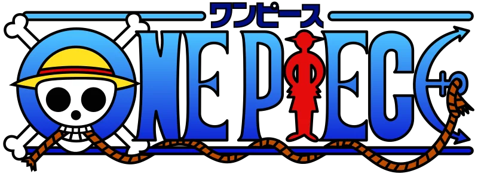

### Salut tout l'monde 👋

<!--
**nicolachoquet06250/nicolachoquet06250** is a ✨ _special_ ✨ repository because its `README.md` (this file) appears on your GitHub profile.

Here are some ideas to get you started:

- 🔭 I’m currently working on ...
- 🌱 I’m currently learning ...
- 👯 I’m looking to collaborate on ...
- 🤔 I’m looking for help with ...
- 💬 Ask me about ...
- 📫 How to reach me: ...
- 😄 Pronouns: ...
- ⚡ Fun fact: ...
-->

# Nicolas Choquet

Développeur Full Stack touche à tout 🙂

Mon langage de prédilection c'est le JavaScript (TypeScript depuis peu) pour son angle d'attaque extra-large.
En gros on peux absoluement tout faire avec en partant évidement du web classique en passant par du mobile et jusqu'à de la réalité virtuelle/augmentée voir du jeu vidéo 😁

## 🚀 À propos de moi

J'ai 28 ans et je suis absoluement passionné de prog.

Ma deuxième passion n'a rien à voir avec l'informatique, c'est le chant 😁

## 🔗 Mes réseaux

## Mes projets phares

### WebOS Apple (Portfolio)

#### Liens

#### Technologies utilisées

### Framework de création d'aliases complexes

#### Liens

#### Technologies utilisées

### La Devengers Toolbox

#### Liens

 

#### Technologies utilisées

### Editeur visuel en React pour React

#### Liens

 

#### Technologies utilisées

### Editeur visuel en Vue pour Vue

#### Liens

 

#### Technologies utilisées

## Indice sur mon prochain projet 😉

<table style="border-collapse: unset;">
    <tr>
        <td style="border: none;">
            
        </td>
        <td style="border: none;">
            
        </td>
    </tr>
</table>

Pour cela, je cherche un modelisateur 3D qui maitrise  mais surtout j'ai besoin que cette personne ai du temps libre à donner car étant donné que la licence appartient en grosse partie à , je ne peux pas me permettre une commercialisation.
Ce projet ne sera donc accessible uniquement aux contributeurs.

 si vous êtes intéressé.

<!--

    
Cliquez ici pour télécharger mon CV ...

- [Au format PDF](./assets/cv_assets/CV%20Nicolas%20Choquet%202024.pdf)
- [Au format DOCX](./assets/cv_assets/CV%20Nicolas%20Choquet%202024.docx)

-->
